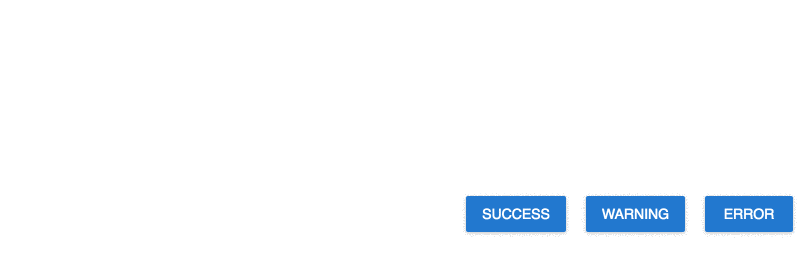
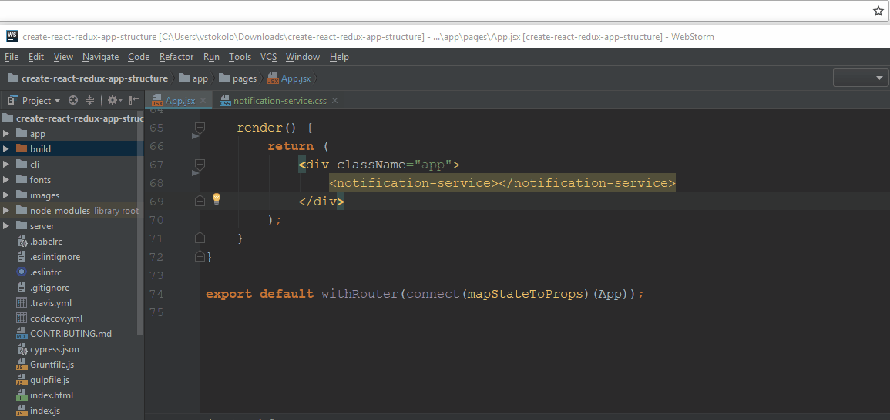

# Notification Service [](https://twitter.com/intent/tweet?hashtags=javascript%20%23webcomponents&original_referer=https%3A%2F%2Fpublish.twitter.com%2F%3FbuttonHashtag%3Djavascript%2520%2523webcomponents%26buttonText%3DNotification%2520Service%2520based%2520on%2520Custom%2520Elements.%2520Integrate%2520everywhere.%26buttonType%3DTweetButton%26buttonUrl%3Dhttps%253A%252F%252Fgithub.com%252Fshystruk%252Fnotification-service-js%26buttonVia%3Dshystrukk%26widget%3DButton&ref_src=twsrc%5Etfw&text=Notification%20Service%20based%20on%20Custom%20Elements.%20Integrate%20everywhere.&tw_p=tweetbutton&url=https%3A%2F%2Fgithub.com%2Fshystruk%2Fnotification-service-js&via=shystrukk) #
[](https://www.webcomponents.org/element/notification-service-js) [](https://opensource.org/licenses/mit-license.php) [](https://badge.fury.io/js/notification-service-js)


Notification Service provides a simple show/hide message. It is based on [CustomElements](https://developer.mozilla.org/en-US/docs/Web/Web_Components/Using_custom_elements) and may be integrated with any framework. Push notification works through [CustomEvent](https://www.npmjs.com/package/custom-event-js) dispatcher.
**Notification Service supports all popular browsers, including Internet Explorer 11, although some polyfills are required for IE 11. Please see [here](https://www.webcomponents.org/polyfills).** 





## Installation ##
#### npm
`npm install notification-service-js`

#### yarn
`yarn add notification-service-js`

## Usage ##
```javascript
// As a module
import 'notification-service-js'

// As a <script> tag
<script src="node_modules/notification-service-js/build/notification-service.js"></script>

// Insert web component into the DOM
<notification-service></notification-service>
```

### Push notification
```javascript
CustomEvent.DISPATCH('WEB_COMP_SHOW_NOTIFICATION', {
    type: 'success', // success, error, warning
    message: 'Your message has been sent',
    timer: 3000 // default 5000, not required
})
```

## Options
```javascript
CustomEvent.DISPATCH('EVENT_NAME', options)
```

### type ###
Type: `string` <br>
Values: `success, error, warning` <br>
A class which will be added to the notification content `.web-nc-content.<type>`. Depends on the class CSS styles will be applied to the content. You can add your own type and add styles through the prop `cross-img-src`.

### message ###
Type: `string` <br>
Content which will be displayed inside notification.

### timer ###
Type: `number` <br>
Default: 5000 <br>
Time in milliseconds how long notification will be showing.


## Props
### cross-img-src ###
The path to an image (png/svg/jpg) file, which will be used for a cross icon.
```html
<notification-service cross-img-src="../images/cross.svg"></notification-service>
```

### style-src ###
The path to .css file, which will be pasted after common styles.

```html
<notification-service style-src="build/style.css"></notification-service>
```


## Contributing

Any contributions you make **are greatly appreciated**.

Please read the [Contributions Guidelines](CONTRIBUTING.md) before submitting a PR.

## License

MIT © [Vasyl Stokolosa](https://about.me/shystruk)
